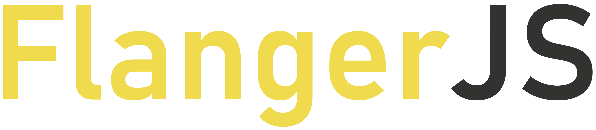

FlangerJS es un framework de desarrollo de videojuegos 2D escrito en JavaScript. Permite al programador tener acceso directo al canvas, al mismo tiempo que dispone de controladores predefinidos.

## Ventajas
- Uso de escenas definidas
- Compatibilidad con pulsaciones del ratón, teclado, y mandos
- Orden de capas adaptable por el desarrollador
- Aplicación de plugins para el entorno 2D
- Control de flujo directo
- Código ordenado

## Instalación
Descargar el proyecto. Es necesario disponer de un navegador web, preferiblemente Google Chrome, y un editor de código como Sublime Text 3 o Visual Studio Code.

## Clases y palabras reservadas
Para trabajar sobre el framework, existen variables y clases que no deben ser modificadas, sobreescritas o acceder a sus datos, puesto que puede dar errores y para esto ya existen unos métodos más directos y legibles.

### Variables reservadas
Las variables reservadas no pueden ser modificadas ni en el nombre ni en sus atributos si no es por métodos. Modificar los atributos es una acción que si se lleva a cabo no bloquea el juego, pero hacerlo puede provocar fallas.
- **canvas**: controla todos los datos del canvas
- **ctx**: guarda el contexto del lienzo
- **interval**: contiene los datos de actualización de pantalla
